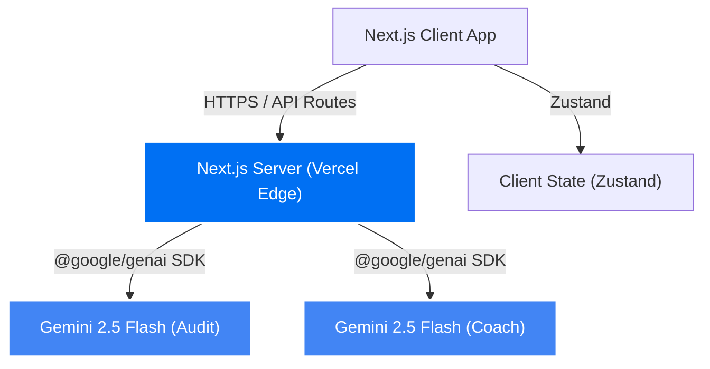

# CarbonWise AI - Architecture

## System Architecture

CarbonWise AI utilises a modern, serverless architecture centred around the Google Cloud ecosystem.

## Core Components
1. **Frontend:** Next.js 14 (App Router), TypeScript, CSS Modules with design tokens.
2. **Backend/Serverless:** Next.js API Routes deployed on Vercel Edge Functions.
3. **AI Layer:** Google GenAI SDK orchestrating Gemini 2.5 Flash for both deep audit reasoning and conversational coaching.
4. **State Management:** Zustand for cross-route persistence of AI audit results.

## Clean Architecture Flow
- `src/app/` — Next.js page routing, layouts, and API routes.
- `src/components/` — Reusable, typed UI components (Card, Navbar).
- `src/lib/` — Services (`apiClient.ts`), AI engine (`gemini.ts`), and state (`store.ts`).
- `src/__tests__/` — Vitest unit and integration tests.

## Key Decisions
- **Lazy AI initialisation** prevents Vercel static-build crashes.
- **Client-side validation** in `apiClient.ts` mirrors server-side limits for immediate feedback.
- **`useCallback` hooks** prevent unnecessary re-renders in interactive components.
